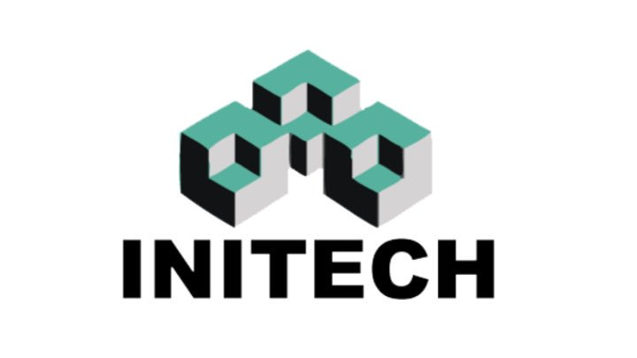

<!--
*** Thanks for checking out the Best-README-Template. If you have a suggestion
*** that would make this better, please fork the repo and create a pull request
*** or simply open an issue with the tag "enhancement".
*** Don't forget to give the project a star!
*** Thanks again! Now go create something AMAZING! :D
-->

<!-- PROJECT SHIELDS -->
<!--
*** I'm using markdown "reference style" links for readability.
*** Reference links are enclosed in brackets [ ] instead of parentheses ( ).
*** See the bottom of this document for the declaration of the reference variables
*** for contributors-url, forks-url, etc. This is an optional, concise syntax you may use.
*** https://www.markdownguide.org/basic-syntax/#reference-style-links
-->

[![Contributors][contributors-shield]][contributors-url]
[![Forks][forks-shield]][forks-url]
[![Stargazers][stars-shield]][stars-url]
[![Issues][issues-shield]][issues-url]
[![MIT License][license-shield]][license-url]
[![LinkedIn][linkedin-shield]][linkedin-url]

<!-- PROJECT LOGO -->
 

  

<h3 align="center">React CV Application</h3>

  

    A simple CV application form made in React.
     
    <a href="https://github.com/palmerusaf/cv-project"><strong>Explore the docs »</strong></a>
     
     
    <a href="https://palmerusaf.github.io/cv-project">View Demo</a>
    ·
    <a href="https://github.com/palmerusaf/cv-project/issues">Report Bug</a>
    ·
    <a href="https://github.com/palmerusaf/cv-project/issues">Request Feature</a>
  

<!-- TABLE OF CONTENTS -->

  
Table of Contents

  <ol>
    <li>
      <a href="#about-the-project">About The Project</a>
      <ul>
        <li><a href="#built-with">Built With</a></li>
      </ul>
    </li>
    <li><a href="#license">License</a></li>
    <li><a href="#contact">Contact</a></li>
    <li><a href="#acknowledgments">Acknowledgments</a></li>
  </ol>

<!-- ABOUT THE PROJECT -->

## About The Project

[![Product Name Screen Shot][product-screenshot]](https://palmerusaf.github.io/cv-project)

The purpose of this project was to get my feet wet with React. During this project I learned how to: store and update states properly, create components, and perform conditional rendering.

(<a href="#top">back to top</a>)

### Built With

- [React.js](https://reactjs.org/)

(<a href="#top">back to top</a>)

<!-- LICENSE -->

## License

Distributed under the MIT License. See `LICENSE.txt` for more information.

(<a href="#top">back to top</a>)

<!-- CONTACT -->

## Contact

Branden Palmer - [@branden_palmer8](https://twitter.com/twitter_handle) - brandenpalmer08@gmail.com

Project Link: [https://github.com/palmerusaf/cv-project](https://github.com/github_username/repo_name)

(<a href="#top">back to top</a>)

<!-- ACKNOWLEDGMENTS -->

## Acknowledgments

- [The Odin Project](https://www.theodinproject.com/)

(<a href="#top">back to top</a>)

<!-- MARKDOWN LINKS & IMAGES -->
<!-- https://www.markdownguide.org/basic-syntax/#reference-style-links -->

[contributors-shield]: https://img.shields.io/github/contributors/palmerusaf/cv-project.svg?style=for-the-badge
[contributors-url]: https://github.com/palmerusaf/cv-project/graphs/contributors
[forks-shield]: https://img.shields.io/github/forks/palmerusaf/cv-project.svg?style=for-the-badge
[forks-url]: https://github.com/palmerusaf/cv-project/network/members
[stars-shield]: https://img.shields.io/github/stars/palmerusaf/cv-project.svg?style=for-the-badge
[stars-url]: https://github.com/palmerusaf/cv-project/stargazers
[issues-shield]: https://img.shields.io/github/issues/palmerusaf/cv-project.svg?style=for-the-badge
[issues-url]: https://github.com/palmerusaf/cv-project/issues
[license-shield]: https://img.shields.io/github/license/palmerusaf/cv-project.svg?style=for-the-badge
[license-url]: https://github.com/palmerusaf/cv-project/blob/master/LICENSE.txt
[linkedin-shield]: https://img.shields.io/badge/-LinkedIn-black.svg?style=for-the-badge&logo=linkedin&colorB=555
[linkedin-url]: https://linkedin.com/in/branden-palmer-968765120
[product-screenshot]: /src/imgs/screen-shot.png
